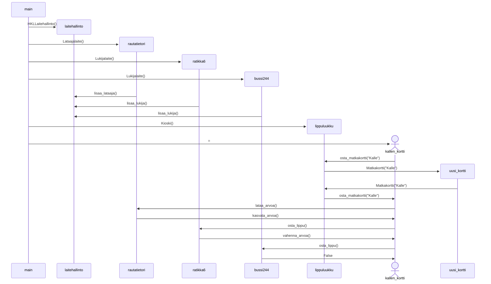

```mermaid
sequenceDiagram
        participant main
        create participant laitehallinto
        main->>laitehallinto: HKLLaitehallinto()

        create participant rautatietori
        main->>rautatietori: Lataajalaite()
        create participant ratikka6
        main->>ratikka6: Lukijalaite()
        create participant bussi244
        main->>bussi244: Lukijalaite()

        rautatietori->>laitehallinto: lisaa_lataaja()
        ratikka6->>laitehallinto: lisaa_lukija()
        bussi244->>laitehallinto: lisaa_lukija()
        
        create participant lippuluukku
        main->>lippuluukku: Kioski()

        create actor kallen_kortti
	main->>kallen_kortti: =
        kallen_kortti->>lippuluukku: osta_matkakortti("Kalle")
        create participant uusi_kortti
        lippuluukku->>uusi_kortti: Matkakortti("Kalle")
        uusi_kortti->>lippuluukku: Matkakortti("Kalle")
        lippuluukku->>kallen_kortti: osta_matkakortti("Kalle")

        kallen_kortti->>rautatietori: lataa_arvoa()
        rautatietori->>kallen_kortti: kasvata_arvoa()

        kallen_kortti->>ratikka6: osta_lippu()
        ratikka6->>kallen_kortti: vahenna_arvoa()

        kallen_kortti->>bussi244: osta_lippu()
        bussi244->>kallen_kortti: False
```