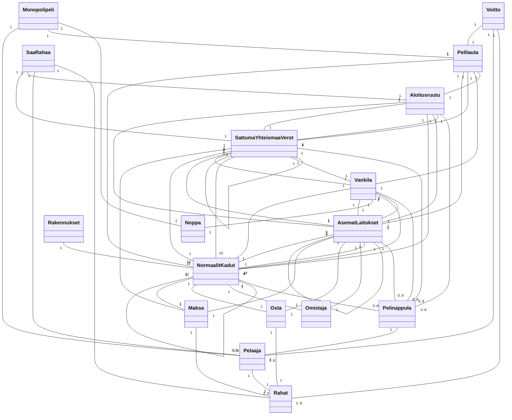

## Monopoli, täydennetty luokkakaavio

```mermaid
 classDiagram
    Monopolipeli "1" -- "2" Noppa
    Monopolipeli "1" -- "1" Pelilauta
    Pelinappula "1" -- "1" Pelaaja
    Pelaaja "2..8" -- "1" Monopolipeli

    Pelaaja "1" -- "1" Rahat
    Maksa "1" -- "2" Rahat
    Osta "1" -- "1" Rahat
    Voitto "1" -- "2..8" Rahat
    Voitto "1" -- "2..8" Pelaaja
    Voitto "1" -- "1" Pelilauta
    SaaRahaa "1" -- "2..8" Rahat
    SaaRahaa "1" -- "2..8" Pelaaja

    Pelilauta "1" -- "1" Aloitusruutu
    Pelilauta "1" -- "1" Vankila
    Pelilauta "1" -- "8" SattumaYhteismaaVerot
    Pelilauta "1" -- "6" AsematLaitokset
    Pelilauta "1" -- "22" NormaalitKadut

    Aloitusruutu "1" -- "0..8" Pelinappula
    Aloitusruutu "1" -- "1" SattumaYhteismaaVerot
    Aloitusruutu "1" -- "1" AsematLaitokset
    Aloitusruutu "1" -- "4" NormaalitKadut
    SaaRahaa "1" -- "1" Aloitusruutu

    Vankila "1" -- "0..8" Pelinappula
    Vankila "1" -- "1" SattumaYhteismaaVerot
    Vankila "1" -- "1" AsematLaitokset
    Vankila "1" -- "4" NormaalitKadut
    Vankila "1" -- "1" Noppa

    SattumaYhteismaaVerot "1" -- "0..8" Pelinappula
    SattumaYhteismaaVerot "1" -- "3" SattumaYhteismaaVerot
    SattumaYhteismaaVerot "1" -- "1" Aloitusruutu
    SattumaYhteismaaVerot "1" -- "1" Vankila
    SattumaYhteismaaVerot "1" -- "16" NormaalitKadut
    SaaRahaa "1" -- "1" SattumaYhteismaaVerot
    Maksa "1" -- "1" SattumaYhteismaaVerot

    AsematLaitokset "1" -- "0..8" Pelinappula
    AsematLaitokset "1" -- "2" AsematLaitokset
    AsematLaitokset "1" -- "4" SattumaYhteismaaVerot
    AsematLaitokset "1" -- "1" Vankila
    AsematLaitokset "1" -- "18" NormaalitKadut
    AsematLaitokset "1" -- "1" Aloitusruutu

    AsematLaitokset "1" -- "1" Omistaja
    AsematLaitokset "1" -- "1" Osta
    AsematLaitokset "1" -- "1" Maksa

    NormaalitKadut "1" -- "0..8" Pelinappula
    NormaalitKadut "1" -- "1" Vankila
    NormaalitKadut "1" -- "8" SattumaYhteismaaVerot
    NormaalitKadut "1" -- "6" AsematLaitokset
    NormaalitKadut "1" -- "22" NormaalitKadut

    NormaalitKadut "1" -- "1" Omistaja
    NormaalitKadut "1" -- "1" Osta
    NormaalitKadut "1" -- "1" Maksa

    Rakennukset "1" -- "22" NormaalitKadut

```
